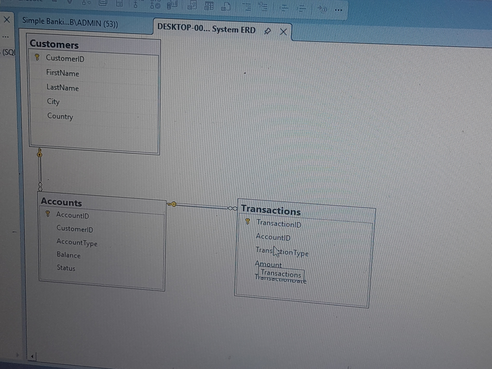

# SIMPLE BANKING DATABASE SYSTEM

A relational database for managing banking customers and transactions using SQL Server

## PROJECT OVERVIEW

This project involves designing and implementing a relational database to manage a simple banking system.It covers database schema design, data insertion and querying using SQL Server (SSMS)

## PROJECT PROBLEM STATEMENT

Banks handle large volumes of customers and transactions data daily and without proper structure, data can become disorganized and difficult to manage.This makes it impossible to :

- Track customers accounts accurately
- Monitor financial transactions
- Retrieve useful insights quickly
  
#### The Solution:

A centralised SQL Server database was designed and implemented to ensure accuracy, consistency and fast data retrieval to enable banks monitor accounts , track transactions and generate financial insights efficiently.

## TOOLS USED

- Database : SQL Server (SSMS)
- Editor : SQL Server Management Studio (SSMS)
- Data Source : CSV (opened in Excel)

## Database Schema & ER Diagram

The system architecture uses a relational schema to ensure data integrity and reduce redundancy. The database consists of three main tables:

- Customers Table: Stores customers personal details (Firstname, Lastname, Email,Phone number).

- Accounts Table: Stores Accounts Information linked to each customer.

- Transactions Table: Records all financial transactions made on all accounts.

The raw data used for this project can be found in the data folder.

